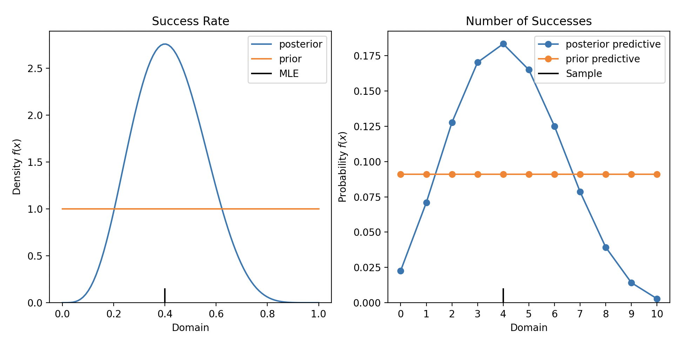

# Conjugate Models

[](https://github.com/astral-sh/ruff)
[](https://github.com/wd60622/conjugate/actions/workflows/tests.yml) 
[](https://badge.fury.io/py/conjugate-models) 
[](https://wd60622.github.io/conjugate/)
[](https://app.codecov.io/github/wd60622/conjugate)

Bayesian conjugate models in Python


## Installation

```bash 
pip install conjugate-models
```

## Features 

- [Connection to Scipy Distributions](https://wd60622.github.io/conjugate/examples/scipy-connection) with `dist` attribute
- [Built in Plotting](https://wd60622.github.io/conjugate/examples/plotting) with `plot_pdf`, `plot_pmf`, and `plot_cdf` methods
- [Vectorized Operations](https://wd60622.github.io/conjugate/examples/vectorized-inputs) for parameters and data
- [Indexing Parameters](https://wd60622.github.io/conjugate/examples/indexing) for subsetting and slicing
- [Generalized Numerical Inputs](https://wd60622.github.io/conjugate/examples/generalized-inputs) for any inputs that act like numbers
    - Out of box compatibility with `polars`, `pandas`, `numpy`, and more.
- [Unsupported Distributions](https://wd60622.github.io/conjugate/examples/pymc-sampling) for sampling from unsupported distributions

## Supported Models 

Many likelihoods are supported including

- `Bernoulli` / `Binomial`
- `Categorical` / `Multinomial`
- `Poisson`
- `Normal` (including linear regression)
- and [many more](https://wd60622.github.io/conjugate/models/)

## Basic Usage

1. Define prior distribution from `distributions` module
1. Pass data and prior into model from `models` modules
1. Analytics with posterior and posterior predictive distributions

```python 
from conjugate.distributions import Beta, BetaBinomial
from conjugate.models import binomial_beta, binomial_beta_predictive

# Observed Data
X = 4
N = 10

# Analytics
prior = Beta(1, 1)
prior_predictive: BetaBinomial = binomial_beta_predictive(n=N, beta=prior)

posterior: Beta = binomial_beta(n=N, x=X, prior=prior)
posterior_predictive: BetaBinomial = binomial_beta_predictive(n=N, beta=posterior) 
```

From here, do any analysis you'd like!

```python
# Figure
import matplotlib.pyplot as plt

fig, axes = plt.subplots(ncols=2)

ax = axes[0]
ax = posterior.plot_pdf(ax=ax, label="posterior")
prior.plot_pdf(ax=ax, label="prior")
ax.axvline(x=X/N, color="black", ymax=0.05, label="MLE")
ax.set_title("Success Rate")
ax.legend()

ax = axes[1]
posterior_predictive.plot_pmf(ax=ax, label="posterior predictive")
prior_predictive.plot_pmf(ax=ax, label="prior predictive")
ax.axvline(x=X, color="black", ymax=0.05, label="Sample")
ax.set_title("Number of Successes")
ax.legend()
plt.show()
```



More examples on in the [documentation](https://wd60622.github.io/conjugate/).

## Contributing

If you are interested in contributing, check out the [contributing guidelines](https://github.com/wd60622/conjugate/blob/main/CONTRIBUTING.md)
