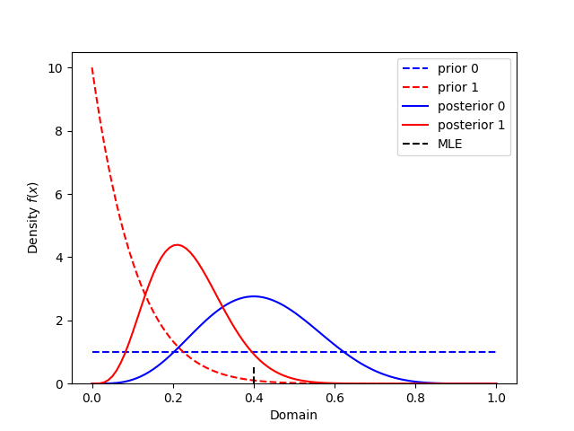
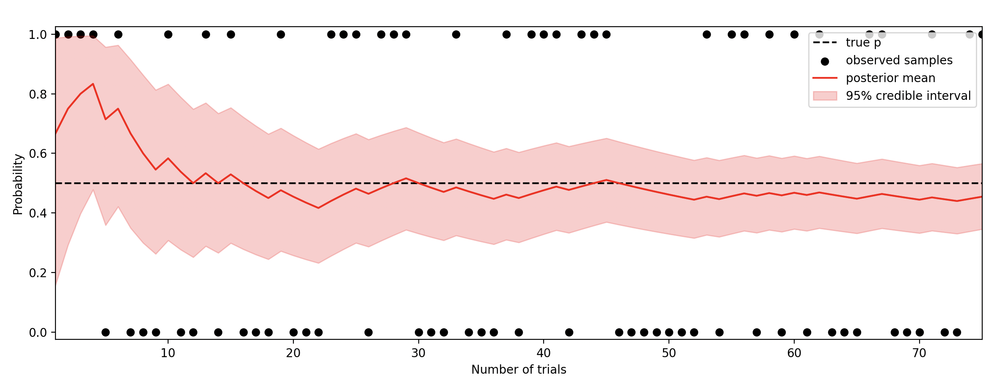

# conjugate priors
Bayesian conjugate models in Python


## Installation

```bash 
pip install conjugate-models
```

## Basic Usage

```python 
from conjugate.distributions import Beta, NegativeBinomial
from conjugate.models import binomial_beta, binomial_beta_posterior_predictive

# Observed Data
X = 4
N = 10

# Analytics
prior = Beta(1, 1)
prior_predictive: NegativeBinomial = binomial_beta_posterior_predictive(n=N, beta=prior)

posterior: Beta = binomial_beta(n=N, x=X, beta_prior=prior)
posterior_predictive: NegativeBinomial = binomial_beta_posterior_predictive(n=N, beta=posterior) 

# Figure
import matplotlib.pyplot as plt

fig, axes = plt.subplots(ncols=2)

ax = axes[0]
ax = posterior.plot_pdf(ax=ax, label="posterior")
prior.plot_pdf(ax=ax, label="prior")
ax.axvline(x=X/N, color="black", ymax=0.05, label="MLE")
ax.set_title("Success Rate")
ax.legend()

ax = axes[1]
posterior_predictive.plot_pmf(ax=ax, label="posterior predictive")
prior_predictive.plot_pmf(ax=ax, label="prior predictive")
ax.axvline(x=X, color="black", ymax=0.05, label="Sample")
ax.set_title("Number of Successes")
ax.legend()
plt.show()
```


## Vectorized Inputs

All data and priors will allow for vectorized assuming the shapes work for broadcasting. 

The plotting also supports arrays of results

```python 
import numpy as np

# Analytics 
prior = Beta(alpha=1, beta=np.array([1, 5]))
posterior = binomial_beta(n=N, x=x, beta_prior=prior)

# Figure
ax = prior.plot_pdf(label=lambda i: f"prior {i}")
posterior.plot_pdf(ax=ax, label=lambda i: f"posterior {i}")
ax.axvline(x=x / N, ymax=0.05, color="black", linestyle="--", label="MLE")
ax.legend()
plt.show()
```



And the distributions can be indexed for subsets. 

```python
beta = np.arange(1, 10)
prior = Beta(alpha=1, beta=beta)

idx = [0, 5, -1]
prior_subset = prior[idx]
prior_subset.plot_pdf(label = lambda i: f"prior {i}")
plt.legend()
plt.show()
```


## Additional Usages

Though the plotting is meant for numpy and python numbers, the conjugate models work with anything that works like numbers. 

For instance, Bayesian models in SQL using SQL Builder

```python
from pypika import Field 

# Columns from table in database
N = Field("total")
X = Field("successes")

# Conjugate prior
prior = Beta(alpha=1, beta=1)
posterior = binomial_beta(n=N, x=X, beta_prior=prior)

print("Posterior alpha:", posterior.alpha)
print("Posterior beta:", posterior.beta)
# Posterior alpha: 1+"successes"
# Posterior beta: 1+"total"-"successes"

# Priors can be fields too
alpha = Field("previous_successes") - 1
beta = Field("previous_failures") - 1

prior = Beta(alpha=alpha, beta=beta)
posterior = binomial_beta(n=N, x=X, beta_prior=prior)

print("Posterior alpha:", posterior.alpha)
print("Posterior beta:", posterior.beta)
# Posterior alpha: "previous_successes"-1+"successes"
# Posterior beta: "previous_failures"-1+"total"-"successes"
```

Using PyMC distributions for sampling with additional uncertainty

```python 
import pymc as pm 

alpha = pm.Gamma.dist(alpha=1, beta=20)
beta = pm.Gamma.dist(alpha=1, beta=20)

# Observed Data
N = 10
X = 4

# Conjugate prior 
prior = Beta(alpha=alpha, beta=beta)
posterior = binomial_beta(n=N, x=X, beta_prior=prior)

# Reconstruct the posterior distribution with PyMC
prior_dist = pm.Beta.dist(alpha=prior.alpha, beta=prior.beta)
posterior_dist = pm.Beta.dist(alpha=posterior.alpha, beta=posterior.beta)

samples = pm.draw([alpha, beta, prior_dist, posterior_dist], draws=1000)
```

## Simple Model

Simple model, sure. Useful model, potentially.

Constant probability of success, `p`, for `n` trials.

```python
rng = np.random.default_rng(42)

# Observed Data
n_times = 75
p = np.repeat(0.5, n_times)
samples = rng.binomial(n=1, p=p, size=n_times)

# Model
n = np.arange(n_times) + 1
prior = Beta(alpha=1, beta=1)
posterior = binomial_beta(n=n, x=samples.cumsum(), beta_prior=prior)

# Figure
plt.plot(n, p, color="black", label="true p", linestyle="--")
plt.scatter(n, samples, color="black", label="observed samples")
plt.plot(n, posterior.dist.mean(), color="red", label="posterior mean")
# fill between the 95% credible interval
plt.fill_between(
    n, 
    posterior.dist.ppf(0.025),
    posterior.dist.ppf(0.975),
    color="red",
    alpha=0.2,
    label="95% credible interval",
)
padding = 0.025
plt.ylim(0 - padding, 1 + padding)
plt.xlim(1, n_times)
plt.legend(loc="best")
plt.xlabel("Number of trials")
plt.ylabel("Probability")
plt.show()
```



Even with a moving probability, this simple to implement model can be useful.

```python 
...

def sigmoid(x):
    return 1 / (1 + np.exp(-x))

p_raw = rng.normal(loc=0, scale=0.2, size=n_times).cumsum()
p = sigmoid(p_raw)

...
```


