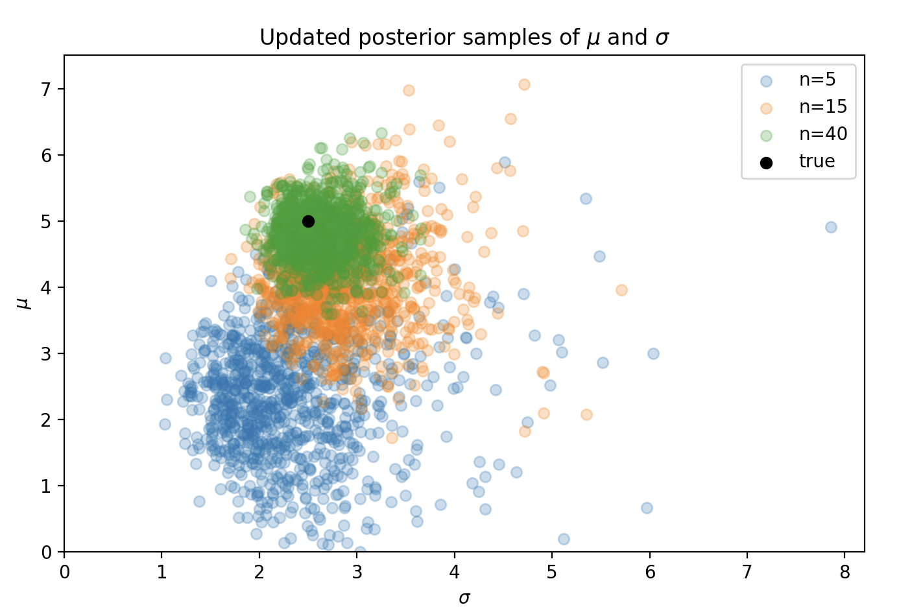

Easy to use Bayesian inference incrementally by making the posterior the prior for the next update.

```python
import numpy as np
import matplotlib.pyplot as plt

from conjugate.distributions import NormalInverseGamma
from conjugate.models import linear_regression

def create_sampler(mu, sigma, rng): 
    """Generate a sampler from a normal distribution with mean `mu` and standard deviation `sigma`."""
    def sample(n: int): 
        return rng.normal(loc=mu, scale=sigma, size=n)
    
    return sample


mu = 5.0
sigma = 2.5
rng = np.random.default_rng(0)
sample = create_sampler(mu=mu, sigma=sigma, rng=rng)


prior = NormalInverseGamma(
    mu=np.array([0]), 
    delta_inverse=np.array([[1]]), 
    alpha=1, beta=1, 
)


cumsum = 0
batch_sizes = [5, 10, 25]
ax = plt.gca()
for batch_size in batch_sizes:
    y = sample(n=batch_size)
    X = np.ones_like(y)[:, None]

    posterior = linear_regression(X, y, prior)
    beta_samples, variance_samples = posterior.sample_beta(size=1000, return_variance=True, random_state=rng)

    cumsum += batch_size
    label = f"n={cumsum}"
    ax.scatter(variance_samples ** 0.5, beta_samples, alpha=0.25, label=label)

    prior = posterior 

ax.scatter(sigma, mu, color="black", label="true")
ax.set(
    xlabel="$\sigma$", 
    ylabel="$\mu$", 
    xlim=(0, None), 
    ylim=(0, None), 
    title="Updated posterior samples of $\mu$ and $\sigma$"
)
ax.legend()

plt.show()
```


