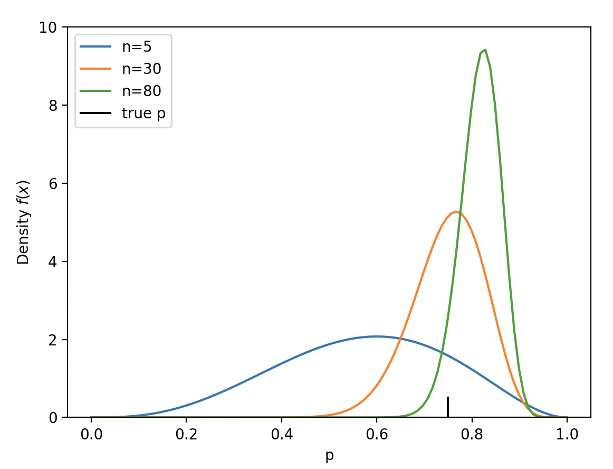

Easy to use Bayesian inference incrementally by setting the posterior to the prior for the next set of data points. 

Abstractly, something like this: 

```python
prior = ...

for batch_size in batch_sizes:
    data = sample(n=batch_size)

    posterior = model(data, prior=prior)

    prior = posterior
```

Below are some concrete examples

## Normal Distribution

We can use the normal model with `NormalInverseGamma` distribution as prior

```python
import numpy as np
import matplotlib.pyplot as plt

from conjugate.distributions import NormalInverseGamma
from conjugate.models import normal_normal_inverse_gamma

def create_sampler(mu, sigma, rng): 
    """Generate a sampler from a normal distribution with mean `mu` and standard deviation `sigma`."""
    def sample(n: int): 
        return rng.normal(loc=mu, scale=sigma, size=n)
    
    return sample


mu = 5.0
sigma = 2.5
rng = np.random.default_rng(0)
sample = create_sampler(mu=mu, sigma=sigma, rng=rng)


prior = NormalInverseGamma(
    mu=0, 
    alpha=1, beta=1, 
    nu=1, 
)

cumsum = 0
batch_sizes = [5, 10, 25]
ax = plt.gca()
for batch_size in batch_sizes:
    data = sample(n=batch_size)

    posterior = normal_normal_inverse_gamma(
        x_total=data.sum(), 
        x2_total=(data ** 2).sum(), 
        n=batch_size, 
        prior=prior
    )

    beta_samples, variance_samples = posterior.sample_beta(size=1000, return_variance=True, random_state=rng)

    cumsum += batch_size
    label = f"n={cumsum}"
    ax.scatter(variance_samples ** 0.5, beta_samples, alpha=0.25, label=label)

    prior = posterior 

ax.scatter(sigma, mu, color="black", label="true")
ax.set(
    xlabel="$\sigma$", 
    ylabel="$\mu$", 
    xlim=(0, None), 
    ylim=(0, None), 
    title="Updated posterior samples of $\mu$ and $\sigma$"
)
ax.legend()

plt.show()
```


## Binomial Distribution

With a Binomial model, we can assume as Beta prior


```python 
import numpy as np

import matplotlib.pyplot as plt

from conjugate.distributions import Beta
from conjugate.models import binomial_beta

def create_sampler(p, rng): 
    def sampler(n: int): 
        return rng.binomial(n=n, p=p)

    return sampler

prior = Beta(1, 1)

p = 0.75
rng = np.random.default_rng(0)
sample = create_sampler(p=p, rng=rng)

ax = plt.gca()
cumsum = 0
batch_sizes = [5, 25, 50]
for batch_size in batch_sizes: 
    x = sample(n=batch_size)

    posterior = binomial_beta(
        x=x, 
        n=batch_size, 
        prior=prior, 
    )

    cumsum += batch_size
    label = f"n={cumsum}"

    posterior.plot_pdf(ax=ax, label=label)

    prior = posterior

ax.axvline(p, label="true p", color="black", ymax=0.05)
ax.set(
    xlabel="p", 
    ylim=(None, 10), 
)
ax.legend()
plt.show()
```


    

        
