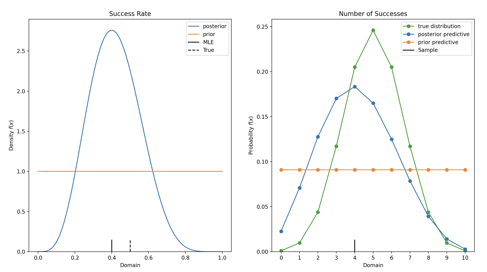

# Binomial Model 

The [Binomial
distribution](https://en.wikipedia.org/wiki/Binomial_distribution) models the
number of successes in a fixed number of independent Bernoulli trials. The
probability of success, $p$, is thought to be unknown and is estimated from the
data.

This example demonstrates how to fit a Binomial model with a Beta prior and
compares the prior and posterior distributions as well as the predictive
distributions with the true distribution of 

## Import modules

Import the required distributions: 

- `Binomial`: The assumed model likelihood in order to generate synthetic data
- `Beta`: Prior for `Binomial` distribution
- `BetaBinomial`: The predictive distribution for the `Binomial` model

and the functions: 

- `binomial_beta`: get the posterior distribution from prior and data
- `binomial_beta_predictive`: get the predictive distribution

```python 
from conjugate.distributions import Beta, Binomial, BetaBinomial
from conjugate.models import binomial_beta, binomial_beta_predictive

import matplotlib.pyplot as plt
```

## Observed Data

Generate some data from the assumed likelihood

```python
N = 10
true_dist = Binomial(n=N, p=0.5)

# Observed Data
X = true_dist.dist.rvs(size=1, random_state=42)
```

## Bayesian Inference

### Posterior Distribution

Get the posterior with `binomial_beta` using the sufficient statistics `n` and
`x` and the prior distribution:

```python
prior = Beta(alpha=1, beta=1)
posterior: Beta = binomial_beta(n=N, x=X, prior=prior)
```

### Predictive Distribution

Get the predictive distribution for `n` new trials with
`binomial_beta_predictive` function:

```python
prior_predictive: BetaBinomial = binomial_beta_predictive(
    n=N, 
    distribution=prior, 
)
posterior_predictive: BetaBinomial = binomial_beta_predictive(
    n=N, 
    distribution=posterior, 
)
```

## Additional Analysis

Perform any analysis on the distributions to compare the prior and posterior as
well as the predictive distributions with the true distribution.

```python

# Figure 
fig, axes = plt.subplots(ncols=2, nrows=1, figsize=(8, 4))

# Prior and Posterior
ax: plt.Axes = axes[0]
posterior.plot_pdf(ax=ax, label="posterior")
prior.plot_pdf(ax=ax, label="prior")
ax.axvline(x=X/N, color="black", ymax=0.05, label="MLE")
ax.axvline(x=true_dist.p, color="black", ymax=0.05, linestyle="--", label="True")
ax.set_title("Success Rate")
ax.legend()

# Predictive Distributions & True Distribution
ax: plt.Axes = axes[1]
true_dist.plot_pmf(ax=ax, label="true distribution", color="C2")
posterior_predictive.plot_pmf(ax=ax, label="posterior predictive")
prior_predictive.plot_pmf(ax=ax, label="prior predictive")
ax.axvline(x=X, color="black", ymax=0.05, label="Sample")
ax.set_title("Number of Successes")
ax.legend()
```


