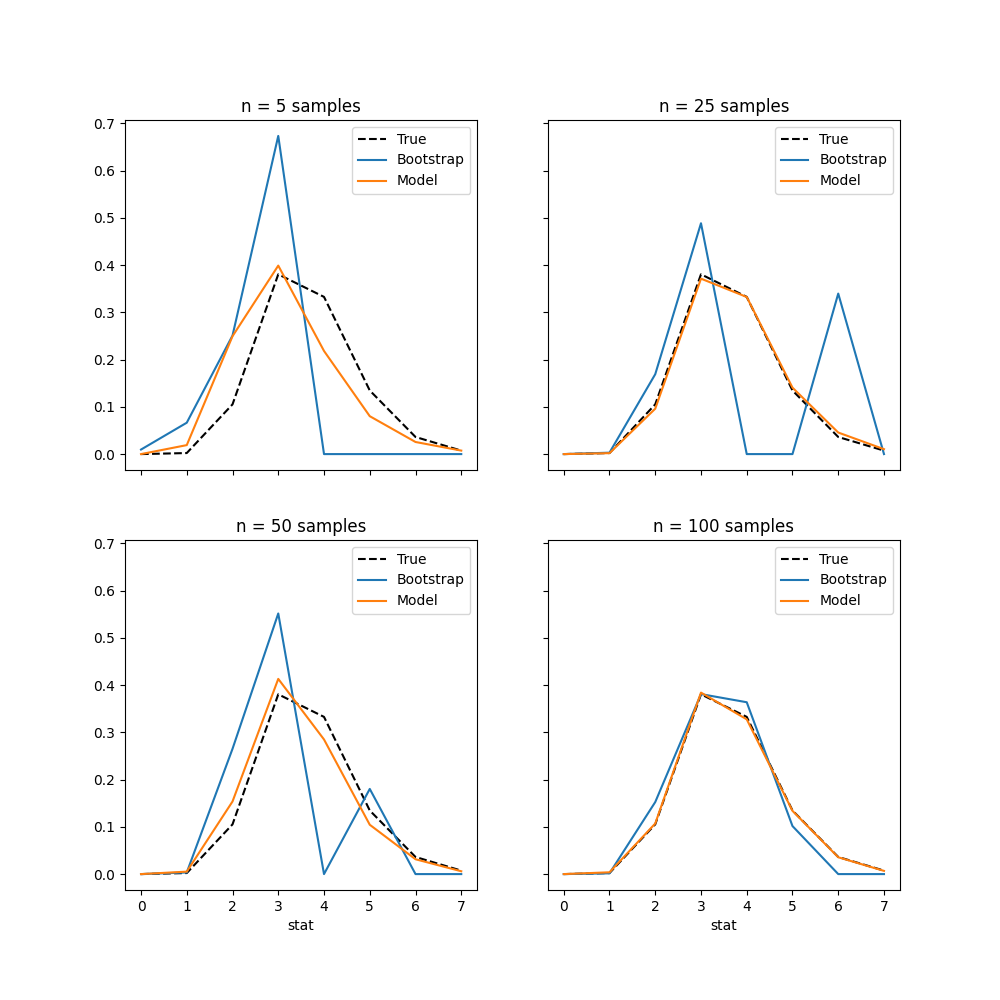

# Bootstrap Comparison

In this example, we will compare the bootstrap method with the use of a
Bayesian model.

Bootstrap is statistical method which relies on resampling of the 
data in order to estimate the uncertainty of a given statistic. 

In order to do this comparison, the [`pandas-bootstrap`
package](https://wd60622.github.io/pandas-bootstrap/) will be used.


The statistic in this example will be the maximum value of 10 samples.


## Setup

Imports and setup of random number generator. Here, we will assume that the
data comes from a Poisson distribution with an unknown rate parameter.

```python
import numpy as np
import pandas as pd

import matplotlib.pyplot as plt

import bootstrap

from conjugate.distributions import (
    Gamma, 
    NegativeBinomial,
    Poisson, 
)
from conjugate.models import (
    poisson_gamma, 
    poisson_gamma_predictive,
)

seed = sum(map(ord, "Bootstrap comparison"))
rng = np.random.default_rng(seed)

true_lambda = 1.5
true_distribution = Poisson(true_lambda)

def create_data_generator(true_distribution, rng): 
    def generate_data(size) -> pd.Series:
        return pd.Series(true_distribution.dist.rvs(size=size, random_state=rng))
    return generate_data


generate_data = create_data_generator(true_distribution, rng)
```

## Bootstrap method

In order to generate the statistic for the bootstrap method, we just need to
create function that gets the maximum value of the desired sample size. 

The `boot` attribute of the `pandas.Series` is an object from
`pandas-bootstrap` to facilitate the bootstrap process. Read more about it in the 
documentation [here](https://wd60622.github.io/pandas-bootstrap/extensions/).

```python
n_new = 10
samples = 5_000

def stat(data: pd.Series, n: int) -> int:
    return data.sample(frac=1).iloc[:n].max()

def create_bootstrap_stat(n_new: int, samples: int):
    def bootstrap_stat(data: pd.Series) -> pd.Series: 
        return data.boot.get_samples(stat, n=n_new, B=samples)
    return bootstrap_stat

bootstrap_stat = create_bootstrap_stat(n_new, samples)
```

## Conjugate model

For the Bayesian model, we will use a Gamma prior as that is the conjugate
prior for the Poisson distribution.

```python
def get_posterior_predictive(data: pd.Series, prior: Gamma) -> NegativeBinomial:
    x_total = data.sum()
    n = len(data)
    posterior = poisson_gamma(x_total=x_total, n=n, gamma_prior=prior)
    return poisson_gamma_predictive(posterior)

def create_conjugate_stat(n_new: int, samples: int, prior: Gamma): 
    def conjugate_stat(data: pd.Series) -> pd.Series: 
        posterior_predictive = get_posterior_predictive(data, prior)
        return pd.Series(
            posterior_predictive
            .dist
            .rvs((n_new, samples))
            .max(axis=0)
        )
    return conjugate_stat

prior = Gamma(1, 1)
conjugate_stat = create_conjugate_stat(n_new=n_new, samples=samples, prior=prior)
```

## Comparison

Compare the two methods across different sample sizes by plotting the PDF of
the maximum value of 10 samples.

```python
ns = [5, 25, 50, 100]

nrows = 2
ncols = 2
fig, axes = plt.subplots(
    nrows=nrows, 
    ncols=ncols, 
    figsize=(ncols * 5, nrows * 5),
    sharex=True, 
    sharey=True,
)

def plot_processing(samples: pd.Series, max_value: int) -> pd.Series:
    return (
        samples
        .value_counts(normalize=True)
        .reindex(range(0, max_value), fill_value=0)
    )

max_value = 8

true_samples = pd.Series(
    true_distribution.dist.rvs((n_new, samples)).max(axis=0),
)
true_pdf = true_samples.pipe(plot_processing, max_value=max_value)

for ax, n in zip(axes.ravel(), ns):
    data = generate_data(size=n)

    bootstrap_samples = data.pipe(bootstrap_stat)
    conjugate_samples = data.pipe(conjugate_stat)

    true_pdf.plot(ax=ax, label="True", color="black", linestyle="--")
    bootstrap_samples.pipe(plot_processing, max_value=max_value).plot(ax=ax, label="Bootstrap")
    conjugate_samples.pipe(plot_processing, max_value=max_value).plot(ax=ax, label="Model")

    ax.legend()
    ax.set(title=f"{n = } samples")
```

<!---
plt.savefig("./docs/images/bootstrap-comparison.png")
plt.close()
--->



The plot shows the stability of the Bayesian model compared to the bootstrap
method as well as the strength that Bayes methods have in low sample size
scenarios.
