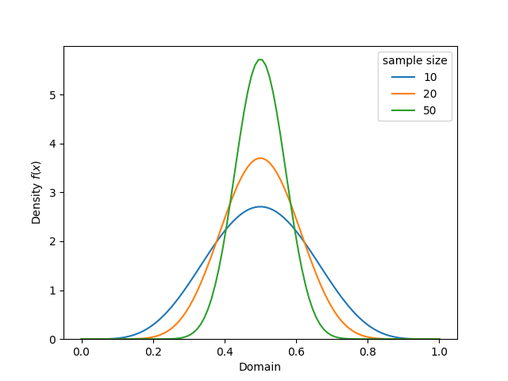

# Generalized Numerical Inputs

Conjugate models work with anything that works like numbers. 

## Polars

For instance, Bayesian models with the Polars package: 

```python
import polars as pl

# Data
df = pl.DataFrame({
    "total": [10, 20, 50],
    "successes": [5, 10, 25]
})

# Conjugate prior
prior = Beta(alpha=1, beta=1)
posterior = binomial_beta(n=df["total"], x=df["successes"], beta_prior=prior)

ax = posterior.plot_pdf(label=df["total"])
ax.legend(title="sample size")
```



## Models with SQL

For instance, Bayesian models in SQL using the SQL Builder, [PyPika](https://github.com/kayak/pypika)

```python
from pypika import Field 

# Columns from table in database
N = Field("total")
X = Field("successes")

# Conjugate prior
prior = Beta(alpha=1, beta=1)
posterior = binomial_beta(n=N, x=X, beta_prior=prior)

print("Posterior alpha:", posterior.alpha)
print("Posterior beta:", posterior.beta)
# Posterior alpha: 1+"successes"
# Posterior beta: 1+"total"-"successes"

# Priors can be fields too
alpha = Field("previous_successes") - 1
beta = Field("previous_failures") - 1

prior = Beta(alpha=alpha, beta=beta)
posterior = binomial_beta(n=N, x=X, beta_prior=prior)

print("Posterior alpha:", posterior.alpha)
print("Posterior beta:", posterior.beta)
# Posterior alpha: "previous_successes"-1+"successes"
# Posterior beta: "previous_failures"-1+"total"-"successes"
```

## PyMC

Using PyMC distributions for sampling with additional uncertainty

```python 
import pymc as pm 

alpha = pm.Gamma.dist(alpha=1, beta=20)
beta = pm.Gamma.dist(alpha=1, beta=20)

# Observed Data
N = 10
X = 4

# Conjugate prior 
prior = Beta(alpha=alpha, beta=beta)
posterior = binomial_beta(n=N, x=X, beta_prior=prior)

# Reconstruct the posterior distribution with PyMC
prior_dist = pm.Beta.dist(alpha=prior.alpha, beta=prior.beta)
posterior_dist = pm.Beta.dist(alpha=posterior.alpha, beta=posterior.beta)

samples = pm.draw([alpha, beta, prior_dist, posterior_dist], draws=1000)
```
