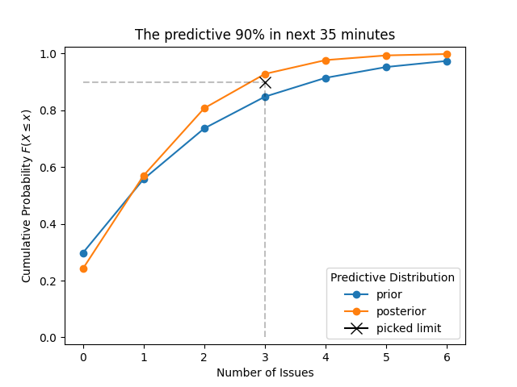

# Determining Limit Size for API Requests

Over the 10 hours, I have collected the number of new issues that have come in.
Each hour is as follows:

```python
data = [3, 5, 4, 1, 0,
        0, 0, 1, 4, 7]
```

For a next time period, I want to estimate the `limit` size that I should use
to get number of new issues that will come in.


!!! note

    I am not interested in the mean of the data, but rather in a quantile
    of the data in order to determine the upper bound for what might come
    in.

I will using a Poisson-Gamma model to determine the issue distribution.

The 90th percentile of the predictive distribution will be used to determine
the limit.

## Modeling the Data

The `Gamma` distribution is used as the prior and the `poisson_gamma` function
is used to calculate the posterior distribution (just another `Gamma`
distribution).

```python
from conjugate.distributions import Gamma
from conjugate.models import poisson_gamma, poisson_gamma_predictive

prior = Gamma.from_occurrences_in_intervals(occurrences=3, intervals=1)
posterior: Gamma = poisson_gamma(n=len(data), x_total=sum(data), prior=prior)
```

## Determining the Limit Size from the Predictive Distribution

I have scenario where the `limit` needs to be determined for the next 35
minutes. Despite having measured intervals of 1 hour, the predictive
distribution can be used to determine the number of issues that will come in
the next 35 minutes by scaling down `n` by the fraction of the hour.

```python
minutes = 35
window_size = minutes / 60
posterior_predictive = poisson_gamma_predictive(
    distribution=posterior,
    n=window_size,
)
```

With this predictive distribution, any statistics can be calculated. For our
case, we are interested in the 90th percentile so we can use the `dist`
attribute to access the numpy distribution which has the `ppf` method for the
quantiles.

The limit size for the next 35 minutes is 3 issues.

```python
percentile = 0.90
limit = posterior_predictive.dist.ppf(percentile).item()
# 3.0
```

## Visualizing the Predictive Distributions

We will compare the prior and posterior predictive distributions to see where
the limit size falls.

!!! tip

    Use the `poisson_gamma_predictive` function with the prior distribution for
    the prior predictive distribution.


```python
prior_predictive = poisson_gamma_predictive(
    distribution=prior,
    n=window_size,
)
```

We can plot the prior and posterior predictive distributions using either
`plot_pmf` or `plot_cdf` methods and the picked limit.

```python
import matplotlib.pyplot as plt

def plot_picked_limit(limit: float, percentile: float, ax: plt.Axes) -> plt.Axes:
    alpha = 0.25
    kwargs = {
        "color": "black",
    }
    x_kwargs  = {
        "marker": "x",
        "markersize": 10,
        "label": "picked limit",
    }
    line_kwargs = {
        "alpha": alpha,
        "linestyle": "--",
    }
    ax.plot([limit], [percentile], **x_kwargs, **kwargs)
    ax.plot([0, limit], [percentile, percentile], **line_kwargs, **kwargs)
    ax.plot([limit, limit], [0, percentile], **line_kwargs, **kwargs)
    return ax

max_value = limit * 2.0
ax = plt.gca()
prior_predictive.set_max_value(max_value).plot_cdf(ax=ax, label="prior")
posterior_predictive.set_max_value(max_value).plot_cdf(ax=ax, label="posterior")
plot_picked_limit(limit, percentile, ax)
padding = 0.025
ax.set(
    ylim=(0 - padding, 1 + padding),
    xlabel="Number of Issues",
    title=f"The predictive {percentile:.0%} in next {minutes} minutes",
)
ax.legend(title="Predictive Distribution")
```

<!--
import matplotlib.pyplot as plt
plt.savefig("docs/images/limit.png")
plt.close()
-->


