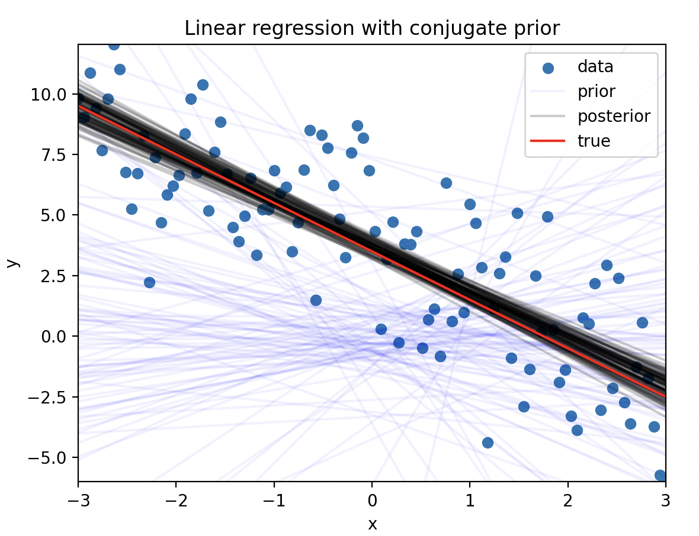

We can fit linear regression that includes a predictive distribution for new data using a conjugate prior. This example only has one covariate, but the same approach can be used for multiple covariates.

## Simulate Data

We are going to simulate data from a linear regression model. The true intercept is 3.5, the true slope is -2.0, and the true variance is 2.5.

```python
import numpy as np
import pandas as pd

import matplotlib.pyplot as plt

from conjugate.distributions import NormalInverseGamma, MultivariateStudentT
from conjugate.models import linear_regression, linear_regression_predictive

intercept = 3.5
slope = -2.0
sigma = 2.5

rng = np.random.default_rng(0)

x_lim = 3
n_points = 100
x = np.linspace(-x_lim, x_lim, n_points)
y = intercept + slope * x + rng.normal(scale=sigma, size=n_points)

```

## Define Prior and Find Posterior

There needs to be a prior for the intercept, slope, and the variance. 

```python
prior = NormalInverseGamma(
    mu=np.array([0, 0]),
    delta_inverse=np.array([[1, 0], [0, 1]]),
    alpha=1,
    beta=1,
)

def create_X(x: np.ndarray) -> np.ndarray:
    return np.stack([np.ones_like(x), x]).T

X = create_X(x)
posterior: NormalInverseGamma = linear_regression(
    X=X,
    y=y,
    normal_inverse_gamma_prior=prior,
)

```

## Posterior Predictive for New Data

The multivariate student-t distribution is used for the posterior predictive distribution. We have to draw samples from it since the scipy implementation does not have a `ppf` method.

```python

# New Data
x_lim_new = 1.5 * x_lim
x_new = np.linspace(-x_lim_new, x_lim_new, 20)
X_new = create_X(x_new)
pp: MultivariateStudentT = linear_regression_predictive(normal_inverse_gamma=posterior, X=X_new)

samples = pp.dist.rvs(5_000).T
df_samples = pd.DataFrame(samples, index=x_new)
```

## Plot Results

We can see that the posterior predictive distribution begins to widen as we move away from the data. 

Overall, the posterior predictive distribution is a good fit for the data. The true line is within the 95% posterior predictive interval.

```python
def plot_abline(intercept: float, slope: float, ax: plt.Axes = None, **kwargs):
    """Plot a line from slope and intercept"""
    if ax is None:
        ax = plt.gca()

    x_vals = np.array(ax.get_xlim())
    y_vals = intercept + slope * x_vals
    ax.plot(x_vals, y_vals, **kwargs)


def plot_lines(ax: plt.Axes, samples: np.ndarray, label: str, color: str, alpha: float):
    for i, betas in enumerate(samples):
        label = label if i == 0 else None
        plot_abline(betas[0], betas[1], ax=ax, color=color, alpha=alpha, label=label)


fig, ax = plt.subplots()
ax.set_xlim(-x_lim, x_lim)
ax.set_ylim(y.min(), y.max())

ax.scatter(x, y, label="data")

plot_lines(
    ax=ax,
    samples=prior.sample_beta(size=100, random_state=rng),
    label="prior",
    color="blue",
    alpha=0.05,
)
plot_lines(
    ax=ax,
    samples=posterior.sample_beta(size=100, random_state=rng),
    label="posterior",
    color="black",
    alpha=0.2,
)

plot_abline(intercept, slope, ax=ax, label="true", color="red")

ax.set(xlabel="x", ylabel="y", title="Linear regression with conjugate prior")

# New Data
ax.plot(x_new, pp.mu, color="green", label="posterior predictive mean")
df_quantile = df_samples.T.quantile([0.025, 0.975]).T
ax.fill_between(
    x_new,
    df_quantile[0.025],
    df_quantile[0.975],
    alpha=0.2,
    color="green",
    label="95% posterior predictive interval",
)
ax.legend()
ax.set(xlim=(-x_lim_new, x_lim_new))
plt.show()
```


