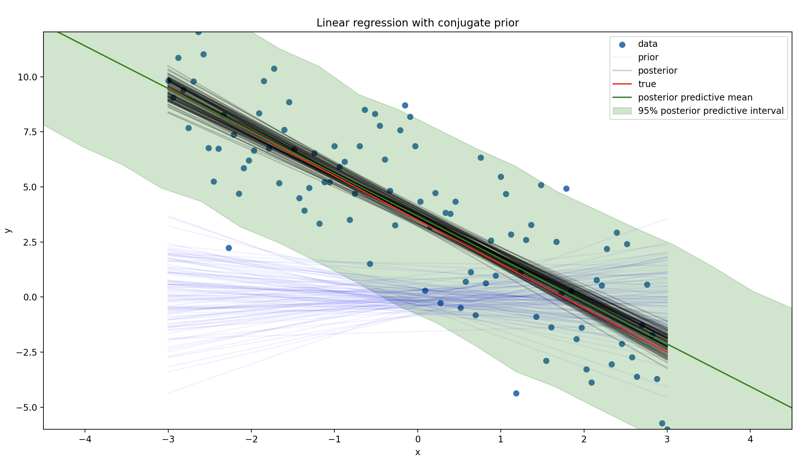

```python
import numpy as np
import matplotlib.pyplot as plt

from conjugate.distributions import NormalInverseGamma
from conjugate.models import linear_regression

intercept = 3.5
slope = -2.0
sigma = 2.5

rng = np.random.default_rng(0)

x_lim = 3
n_points = 100
x = np.linspace(-x_lim, x_lim, n_points)
y = intercept + slope * x + rng.normal(scale=sigma, size=n_points)


prior = NormalInverseGamma(
    mu=np.array([0, 0]),
    delta_inverse=np.array([[1, 0], [0, 1]]),
    alpha=1,
    beta=1,
)

X = np.stack([np.ones_like(x), x]).T
posterior = linear_regression(
    X=X,
    y=y,
    normal_inverse_gamma_prior=prior,
)


def plot_abline(intercept: float, slope: float, ax: plt.Axes = None, **kwargs):
    """Plot a line from slope and intercept"""
    if ax is None:
        ax = plt.gca()

    x_vals = np.array(ax.get_xlim())
    y_vals = intercept + slope * x_vals
    ax.plot(x_vals, y_vals, **kwargs)


def plot_lines(ax: plt.Axes, samples: np.ndarray, label: str, color: str, alpha: float):
    for i, betas in enumerate(samples):
        label = label if i == 0 else None
        plot_abline(betas[0], betas[1], ax=ax, color=color, alpha=alpha, label=label)


fig, ax = plt.subplots()
ax.set_xlim(-x_lim, x_lim)
ax.set_ylim(y.min(), y.max())

ax.scatter(x, y, label="data")

plot_lines(
    ax=ax,
    samples=prior.sample_beta(size=100, random_state=rng),
    label="prior",
    color="blue",
    alpha=0.05,
)
plot_lines(
    ax=ax,
    samples=posterior.sample_beta(size=100, random_state=rng),
    label="posterior",
    color="black",
    alpha=0.2,
)

plot_abline(intercept, slope, ax=ax, label="true", color="red")

ax.set(xlabel="x", ylabel="y", title="Linear regression with conjugate prior")
ax.legend()
plt.show()
```

