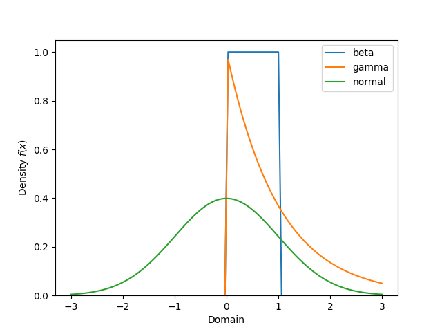

# Plotting Distributions

All the distributions can be plotted using the `plot_pdf` and `plot_pmf`
methods. The `plot_pdf` method is used for continuous distributions and the
`plot_pmf` method is used for discrete distributions.

Similarly, all distributions have a `plot_cdf` method for plotting the
cumulative distribution function.   

There is limited support for some distributions like the `Dirichlet` or those
without a `dist` scipy.


```python 
from conjugate.distributions import Beta, Gamma, Normal

import matplotlib.pyplot as plt

beta = Beta(1, 1)
gamma = Gamma(1, 1)
normal = Normal(0, 1)

bound = 3

dists = [beta, gamma, normal]
labels = ["beta", "gamma", "normal"]

ax = plt.gca()
for label, dist in zip(labels, dists):
    dist.set_bounds(-bound, bound).plot_pdf(label=label)

ax.legend()
```

<!--
plt.savefig("./docs/images/plotting-example.png")
plt.close()
-->



Switch out `plot_pdf` for `plot_cdf` to plot the cumulative distribution function:

```python
ax = plt.gca()
for label, dist in zip(labels, dists):
    dist.set_bounds(-bound, bound).plot_cdf(label=label)

ax.legend()
```

<!--
plt.savefig("./docs/images/plotting-example-cdf.png")
plt.close()
-->


The plotting is also supported for [vectorized inputs](vectorized-inputs.md).
