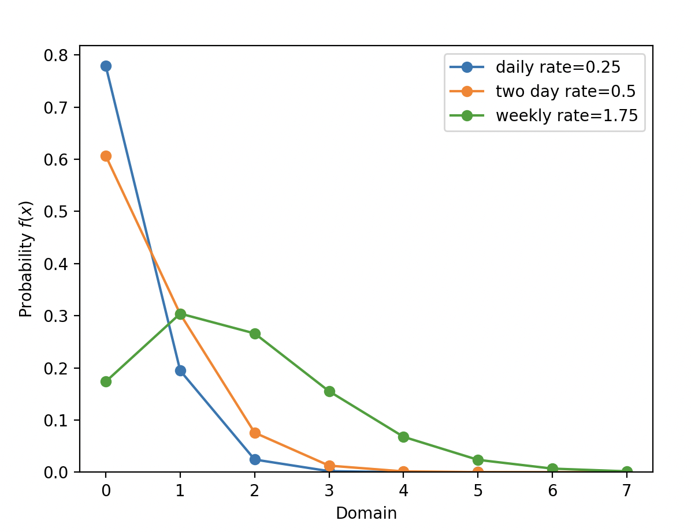
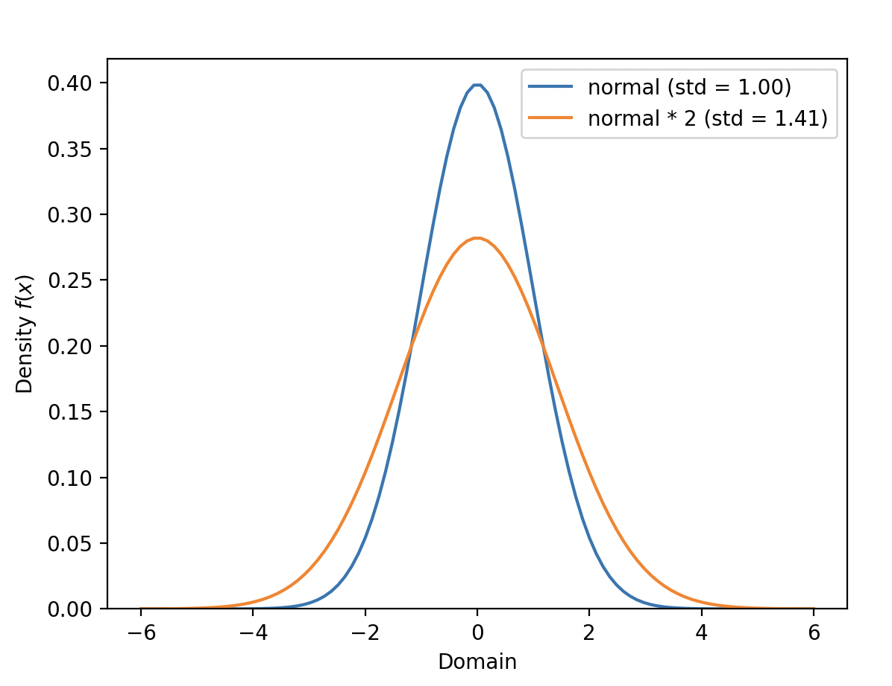

# Scaling Distributions 

Some of the distributions can be scaled by a constant factor or added together. For instance, operations with Poisson distribution represent the number of events in a given time interval. 

```python
from conjugate.distributions import Poisson

import matplotlib.pyplot as plt

daily_rate = 0.25
daily_pois = Poisson(lam=daily_rate)

two_day_pois = daily_pois + daily_pois
weekly_pois = 7 * daily_pois

max_value = 7
ax = plt.gca()
dists = [daily_pois, two_day_pois, weekly_pois]
base_labels = ["daily", "two day", "weekly"]
for dist, base_label in zip(dists, base_labels):
    label = f"{base_label} rate={dist.lam}"
    dist.set_max_value(max_value).plot_pmf(ax=ax, label=label)

ax.legend()
plt.show()
```



The normal distribution also supports scaling making use of the fact that the variance of a scaled normal distribution is the square of the scaling factor. 

```python
from conjugate.distributions import Normal

import matplotlib.pyplot as plt

norm = Normal(mu=0, sigma=1)
norm_times_2 = norm * 2

bound = 6
ax = norm.set_bounds(-bound, bound).plot_pdf(label=f"normal (std = {norm.sigma:.2f})")
norm_times_2.set_bounds(-bound, bound).plot_pdf(ax=ax, label=f"normal * 2 (std = {norm_times_2.sigma:.2f})")
ax.legend()
plt.show()
```

