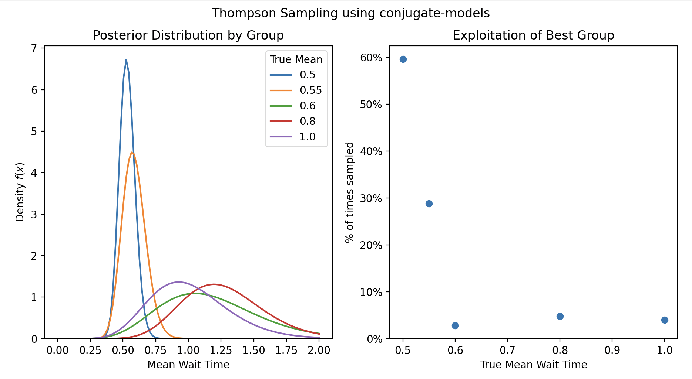

# Thompson Sampling


Thompson sampling is a way to choose action in exploration-exploitation problems
which makes use of posterior distributions for the variable of interest.

## Minimize Waiting Time

We will assume an exponential distribution wait time for each group with an unknown
average wait time for each group. 

The conjugate prior of the exponential distribution is a gamma distribution.

The goal is to find the group with the minimum wait time.


```python
from conjugate.distributions import Gamma, Exponential
from conjugate.models import exponential_gamma

import numpy as np

import matplotlib.pyplot as plt

lam = np.array([0.5, 0.55, 0.6, 0.8, 1])
n_groups = len(lam)

true_dist = Exponential(lam=lam)
```

We will create some helper functions to abstract: 

- sampling from the true distribution of a group
- create the statistics required for Bayesian update of exponential gamma model
- single step in the Thompson sampling process

```python
def sample_true_distribution(
    group_to_sample: int, 
    rng, 
    true_dist: Exponential = true_dist,
) -> float:
    return true_dist[group_to_sample].dist.rvs(random_state=rng)


def bayesian_update_stats(
    group_sampled: int, 
    group_sample: float, 
    n_groups: int = n_groups,
) -> tuple[np.ndarray, np.ndarray]: 
    x = np.zeros(n_groups)
    n = np.zeros(n_groups)

    x[group_sampled] = group_sample
    n[group_sampled] = 1

    return x, n
    

def thompson_step(estimate: Gamma, rng) -> Gamma: 
    sample = estimate.dist.rvs(random_state=rng)

    group_to_sample = np.argmin(sample)

    group_sample = sample_true_distribution(group_to_sample, rng=rng)
    x, n = bayesian_update_stats(group_to_sample, group_sample)

    return exponential_gamma(x, n, gamma_prior=estimate)
```

After defining a prior / initial estimate for each of the distributions, we can use a for loop in
order to perform the Thompson sampling and progressively update this estimate.

```python
alpha = beta = np.ones(n_groups)
estimate = Gamma(alpha, beta)

rng = np.random.default_rng(42)

total_samples = 250
for _ in range(total_samples): 
    estimate = thompson_step(estimate=estimate, rng=rng)
```

We can see that the group with the lowest wait time was actually exploited the most!

```python

fig, axes = plt.subplots(ncols=2)
fig.suptitle("Thompson Sampling using conjugate-models")

ax = axes[0]
estimate.set_max_value(2).plot_pdf(label=lam, ax=ax)
ax.legend(title="True Mean")
ax.set(
    xlabel="Mean Wait Time", 
    title="Posterior Distribution by Group",
)

ax = axes[1]
n_times_sampled = estimate.beta - 1
ax.scatter(lam, n_times_sampled / total_samples)
ax.set(
    xlabel="True Mean Wait Time", 
    ylabel="% of times sampled", 
    ylim=(0, None),
    title="Exploitation of Best Group", 
)
# Format yaxis as percentage
ax.yaxis.set_major_formatter(plt.FuncFormatter(lambda x, _: f"{x:.0%}"))
plt.show()
```


