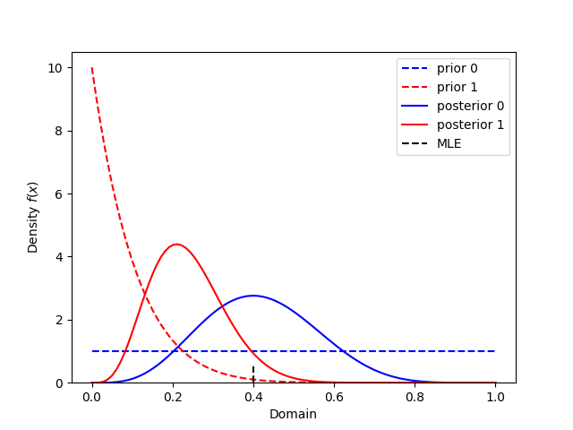

# Vectorized Inputs

All data and priors will allow for vectorized assuming the shapes work for broadcasting. 

The plotting also supports arrays of results

```python 
import numpy as np

from conjugate.distributions import Beta
from conjugate.models import binomial_beta

import matplotlib.pyplot as plt

# Data
N = 10
x = 4

# Analytics 
prior = Beta(alpha=1, beta=np.array([1, 10]))
posterior = binomial_beta(n=N, x=x, prior=prior)

# Figure
colors = ["blue", "red"]
ax = prior.plot_pdf(label=lambda i: f"prior {i}", color=colors, linestyle="--")
posterior.plot_pdf(ax=ax, label=lambda i: f"posterior {i}", color=colors)
ax.axvline(x=x / N, ymax=0.05, color="black", linestyle="--", label="MLE")
ax.legend()
plt.show()
```


