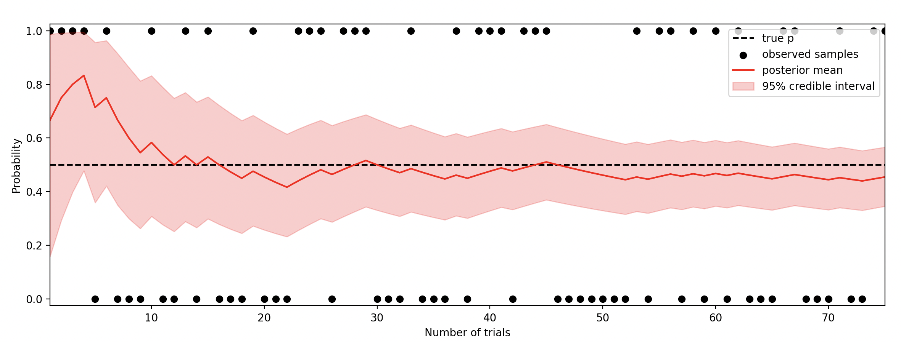
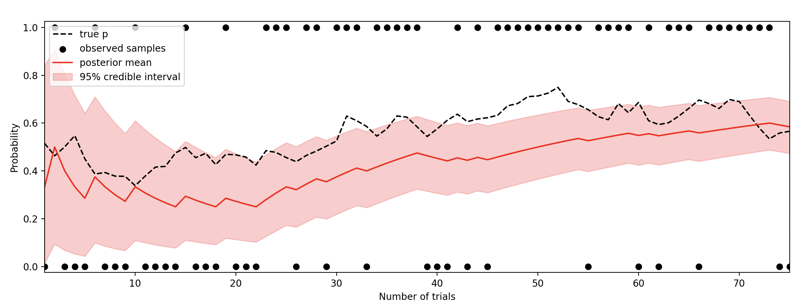

---
hide:
    - navigation 
---
# Conjugate Models

[](https://github.com/astral-sh/ruff)
[](https://github.com/wd60622/conjugate/actions/workflows/tests.yml) 
[](https://badge.fury.io/py/conjugate-models) 
[](https://wd60622.github.io/conjugate/)
[](https://app.codecov.io/github/wd60622/conjugate)

Bayesian conjugate models in Python


## Installation

```bash 
pip install conjugate-models
```

## Features

- [Connection to Scipy Distributions](examples/scipy-connection.md) with `dist` attribute
- [Built in Plotting](examples/plotting.md) with `plot_pdf` and `plot_pmf` methods
- [Vectorized Operations](examples/vectorized-inputs.md) for parameters and data
- [Indexing Parameters](examples/indexing.md) for subsetting and slicing
- [Generalized Numerical Inputs](examples/generalized-inputs.md) for any inputs that act like numbers
    - Out of box compatibility with `polars`, `pandas`, `numpy`, and more.
- [Unsupported Distributions](examples/pymc-sampling.md) for sampling from unsupported distributions

## Supported Models 

Many likelihoods are supported including

- `Bernoulli` / `Binomial`
- `Categorical` / `Multinomial`
- `Poisson`
- `Normal` (including linear regression)
- and [many more](models.md)

## Basic Usage

1. Define prior distribution from `distributions` module
1. Pass data and prior into model from `models` modules
1. Analytics with posterior and posterior predictive distributions

```python 
from conjugate.distributions import Beta, BetaBinomial
from conjugate.models import binomial_beta, binomial_beta_predictive

# Observed Data
X = 4
N = 10

# Analytics
prior = Beta(1, 1)
prior_predictive: BetaBinomial = binomial_beta_predictive(n=N, distribution=prior)

posterior: Beta = binomial_beta(n=N, x=X, prior=prior)
posterior_predictive: BetaBinomial = binomial_beta_predictive(n=N, distribution=posterior) 
```

From here, do any analysis you'd like!

```python

# Figure
import matplotlib.pyplot as plt

fig, axes = plt.subplots(ncols=2)

ax = axes[0]
ax = posterior.plot_pdf(ax=ax, label="posterior")
prior.plot_pdf(ax=ax, label="prior")
ax.axvline(x=X/N, color="black", ymax=0.05, label="MLE")
ax.set_title("Success Rate")
ax.legend()

ax = axes[1]
posterior_predictive.plot_pmf(ax=ax, label="posterior predictive")
prior_predictive.plot_pmf(ax=ax, label="prior predictive")
ax.axvline(x=X, color="black", ymax=0.05, label="Sample")
ax.set_title("Number of Successes")
ax.legend()
plt.show()
```


## Too Simple?

Simple model, sure. Useful model, potentially.

Constant probability of success, `p`, for `n` trials.

```python
rng = np.random.default_rng(42)

# Observed Data
n_times = 75
p = np.repeat(0.5, n_times)
samples = rng.binomial(n=1, p=p, size=n_times)

# Model
n = np.arange(n_times) + 1
prior = Beta(alpha=1, beta=1)
posterior = binomial_beta(n=n, x=samples.cumsum(), prior=prior)

# Figure
plt.plot(n, p, color="black", label="true p", linestyle="--")
plt.scatter(n, samples, color="black", label="observed samples")
plt.plot(n, posterior.dist.mean(), color="red", label="posterior mean")
# fill between the 95% credible interval
plt.fill_between(
    n, 
    posterior.dist.ppf(0.025),
    posterior.dist.ppf(0.975),
    color="red",
    alpha=0.2,
    label="95% credible interval",
)
padding = 0.025
plt.ylim(0 - padding, 1 + padding)
plt.xlim(1, n_times)
plt.legend(loc="best")
plt.xlabel("Number of trials")
plt.ylabel("Probability")
plt.show()
```



Even with a moving probability, this simple to implement model can be useful.

```python 
...

def sigmoid(x):
    return 1 / (1 + np.exp(-x))

p_raw = rng.normal(loc=0, scale=0.2, size=n_times).cumsum()
p = sigmoid(p_raw)

...
```





## Resources

- [Conjugate Priors](https://en.wikipedia.org/wiki/Conjugate_prior)
